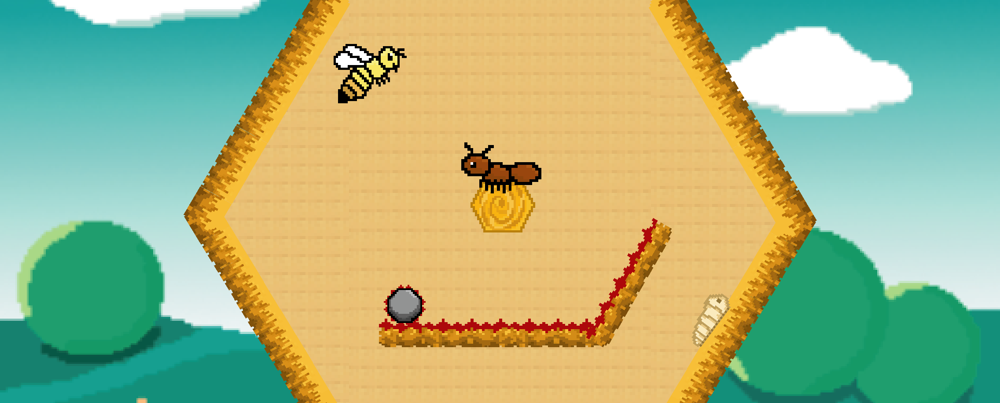
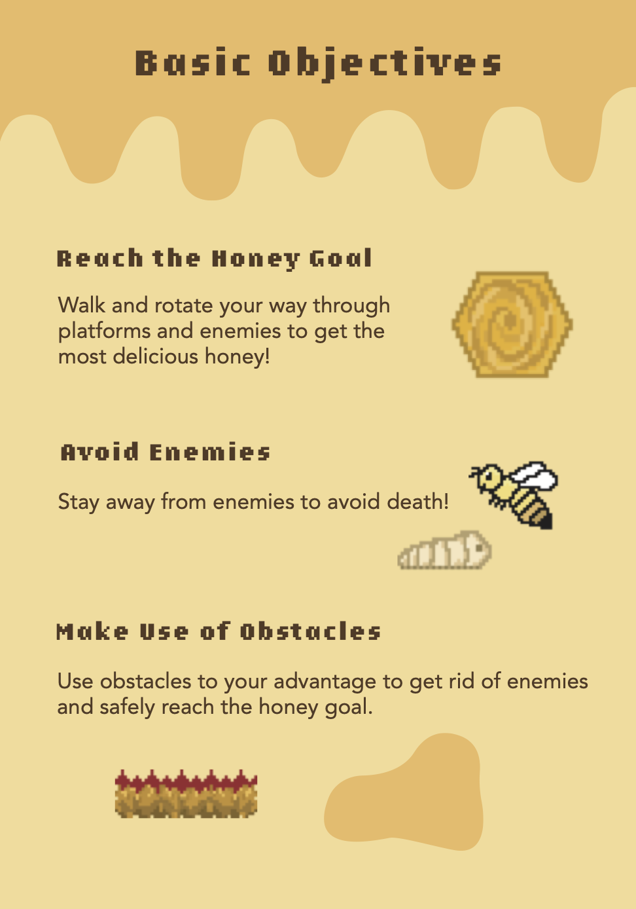
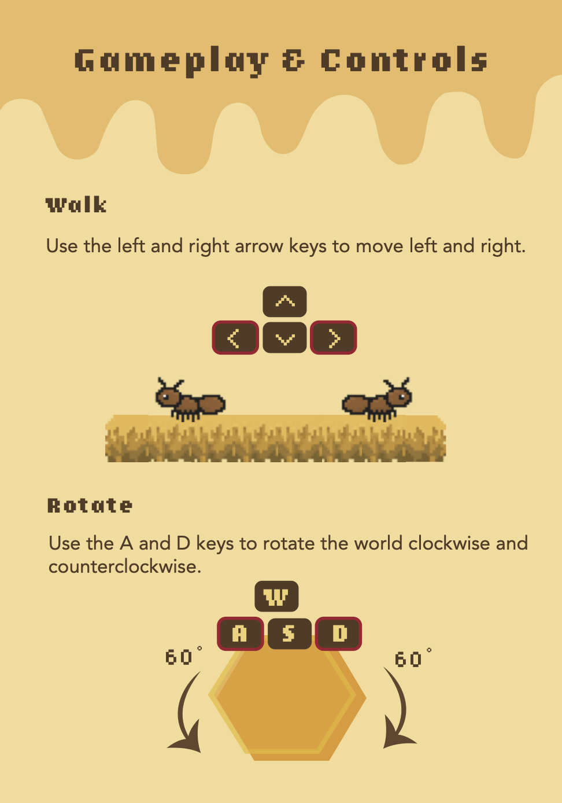

# HoneyHeist

_Capstone Project for CS 3152 - Intro to Game Development_

As an ant in a beehive, you have struck liquid gold. The deeper you delve, the more dense and succulent the honey is. Crawl and rock your way through sticky platforms and enemies towards the core of the hive to get a taste of the finest and most luscious honey the universe has to offer!

## Download:

-   Download the zip from one of the following links

    [Mac Release](https://github.com/NgaiJustin/HoneyHeist/releases/tag/4.3) (MacOS 10.13+)

    [Windows Release](https://github.com/NgaiJustin/HoneyHeist/releases/tag/4.2) (Windows 7+)

-   Unzip
-   Right click, Open

## Objective:

## Controls:

## Team:

Ariya Feng | Design Lead \
Michael Paul Hanlon | Project Lead \
Justin Ngai | Programmer \
Liam Ryu Riley | Software Lead \
Kiryu Sakakibara | Programmer \
Benjamin Lee Stewart | Audio Lead \
Justin C Tse | Programmer \
Yihan Zhang | Programmer
